# ASP.NET Core Request Processing - Visual Architecture Diagrams

## Complete Request Flow Diagram

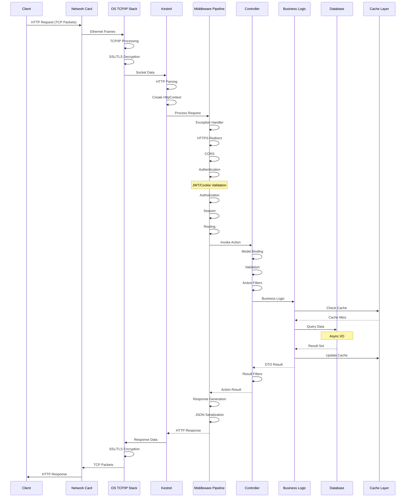

## Thread Pool and Async Execution Flow

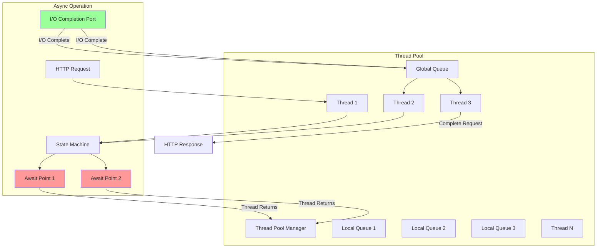

## Memory Management Hierarchy

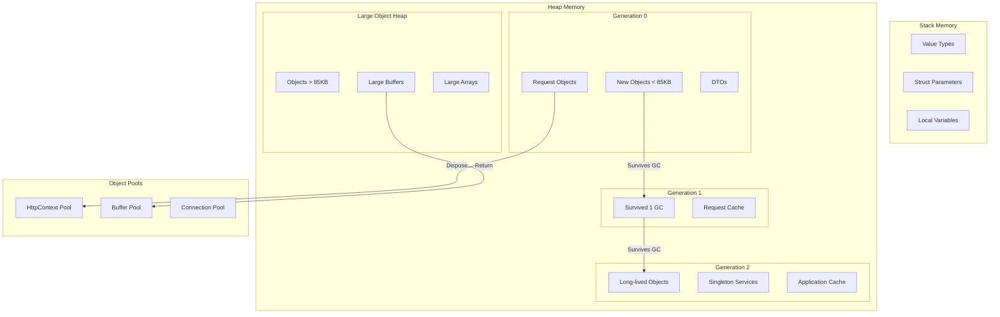

## Middleware Pipeline Architecture

```mermaid
graph LR
    subgraph "Request Flow →"
        R[Request] --> EH[Exception Handler]
        EH --> HTTPS[HTTPS Redirect]
        HTTPS --> CORS[CORS]
        CORS --> AUTH[Authentication]
        AUTH --> AUTHZ[Authorization]
        AUTHZ --> SESSION[Session]
        SESSION --> ROUTING[Routing]
        ROUTING --> EP[Endpoint]
        EP --> ACTION[Controller Action]
    end
    
    subgraph "Response Flow ←"
        ACTION --> RESULT[Result Execution]
        RESULT --> SERIAL[Serialization]
        SERIAL --> COMPRESS[Compression]
        COMPRESS --> HEADERS[Response Headers]
        HEADERS --> CACHE[Response Cache]
        CACHE --> LOG[Logging]
        LOG --> RESP[Response]
    end
    
    style R fill:#99ff99
    style RESP fill:#9999ff
    style ACTION fill:#ffff99
```

## Database Connection Pool Management

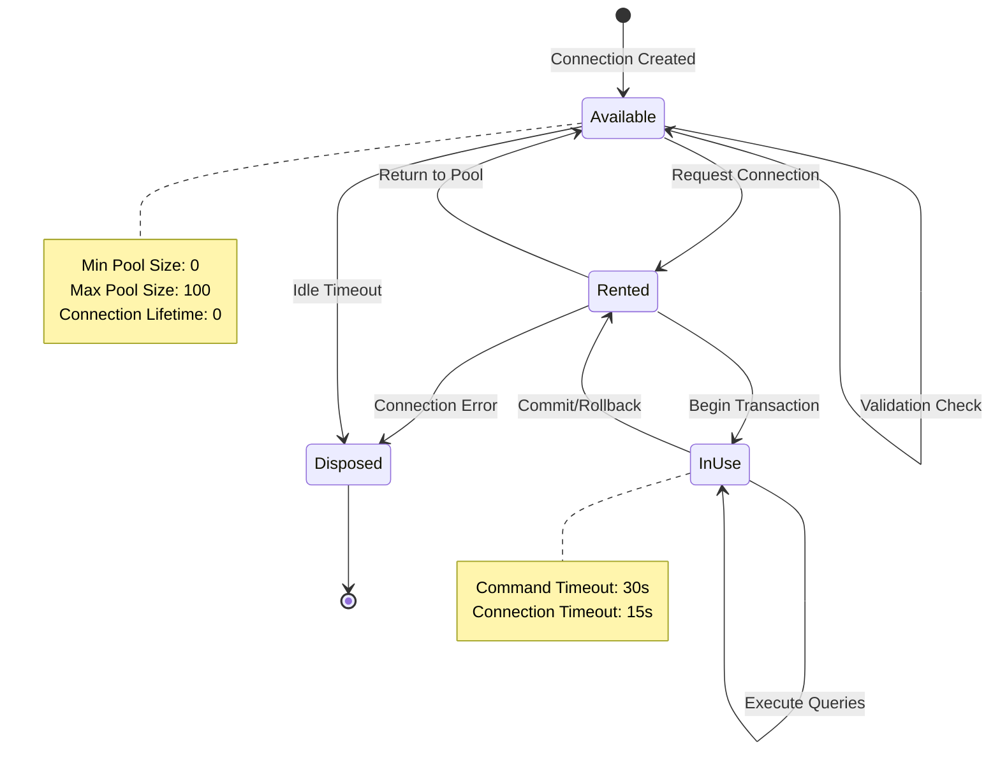

## JWT Authentication Flow

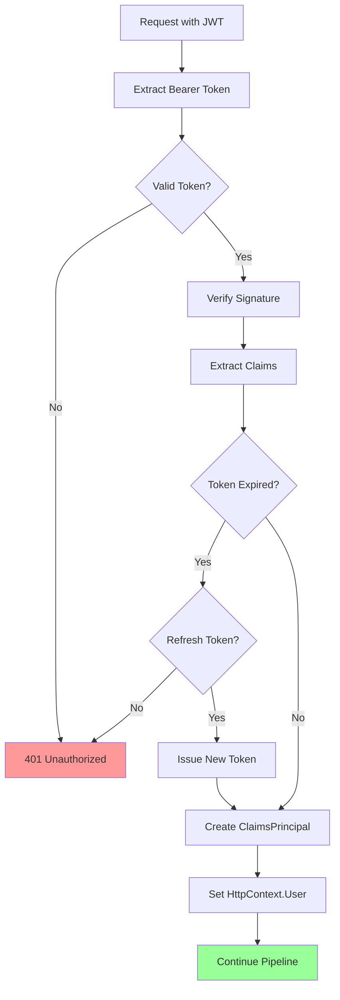

## EF Core Query Execution Pipeline

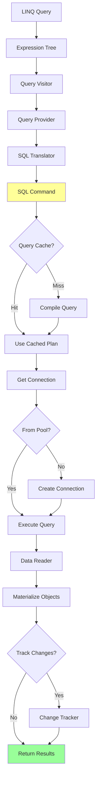

## HTTP/2 Stream Multiplexing

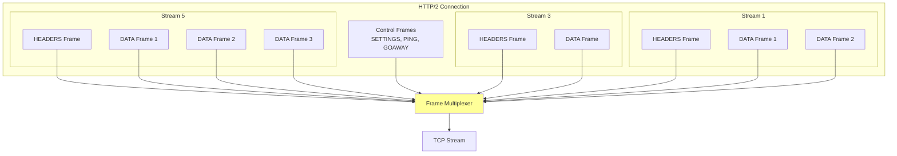

## Request Lifecycle State Machine

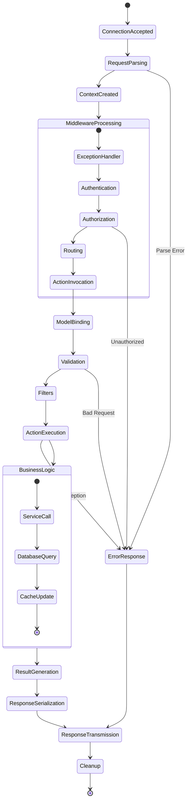

## Performance Bottleneck Analysis

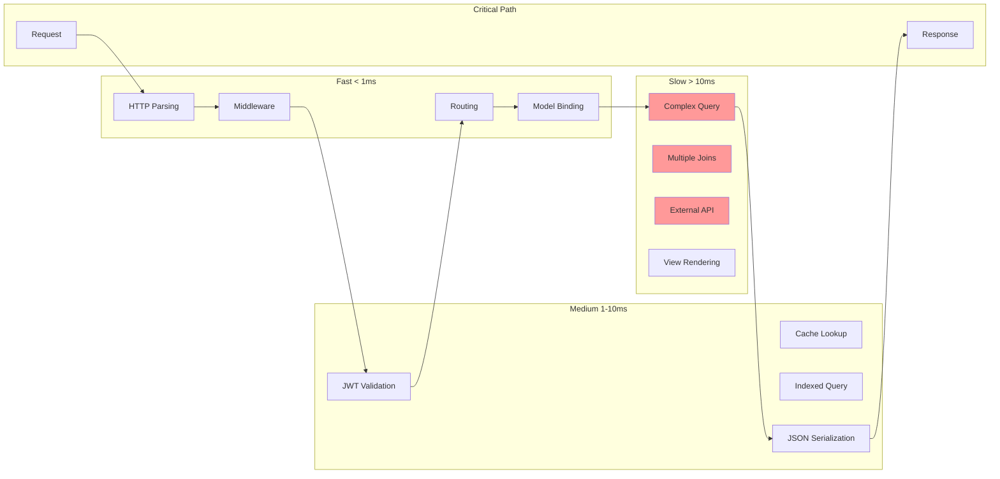

## Service Lifetime Scopes

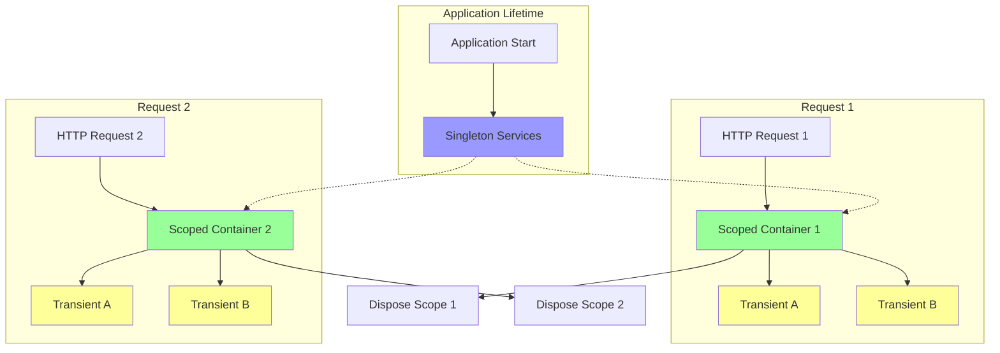

## Configuration System Flow

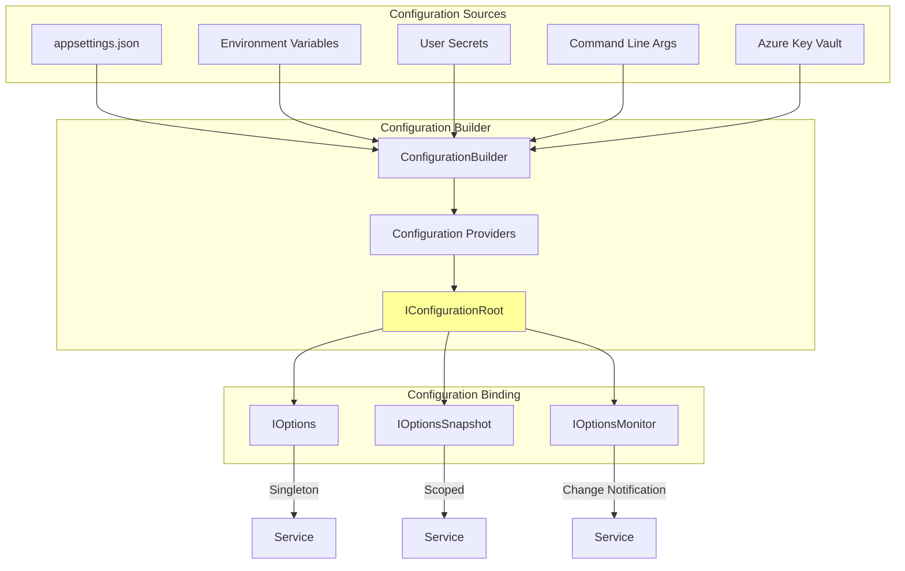

## Complete System Architecture

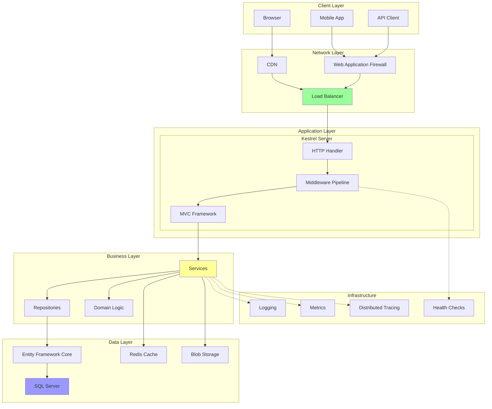
