# ASP.NET Core Request Flow - الرسومات والـ Diagrams

## 📊 الـ Diagrams بالتفصيل

---

## 1️⃣ الـ Complete Request Flow

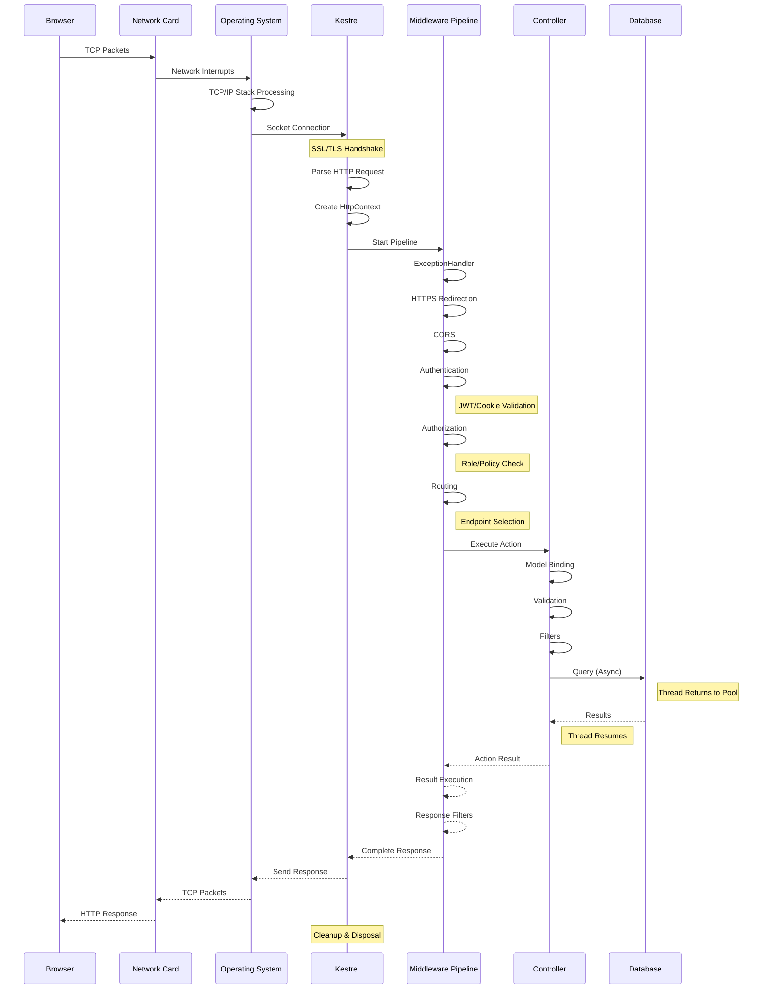

---

## 2️⃣ الـ Middleware Pipeline بالتفصيل

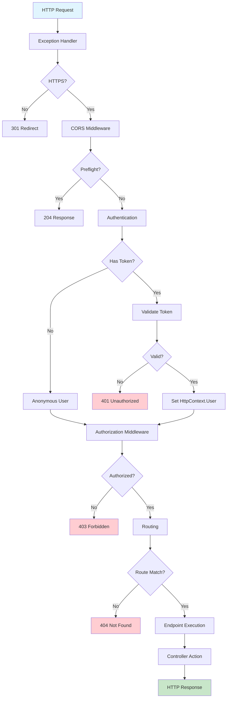

---

## 3️⃣ الـ Async State Machine

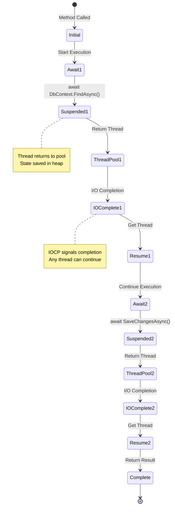

---

## 4️⃣ الـ Thread Pool Lifecycle

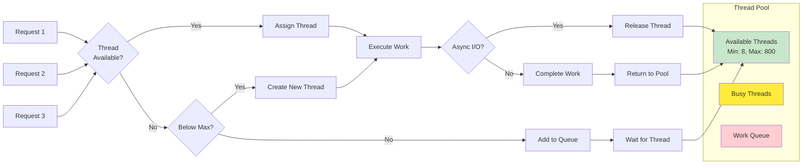

---

## 5️⃣ الـ Database Operation Flow

```mermaid
sequenceDiagram
    participant Controller
    participant DbContext
    participant ChangeTracker
    participant QueryProvider
    participant ConnectionPool
    participant SqlServer
    
    Controller->>DbContext: Users.Where(u => u.Age > 18)
    
    DbContext->>QueryProvider: Build Expression Tree
    QueryProvider->>QueryProvider: Translate to SQL
    
    Note over QueryProvider: SELECT * FROM Users<br/>WHERE Age > 18
    
    QueryProvider->>ConnectionPool: Get Connection
    
    alt Connection Available
        ConnectionPool-->>QueryProvider: Existing Connection
    else No Connection
        ConnectionPool->>SqlServer: Open New Connection
        SqlServer-->>ConnectionPool: Connection Opened
        ConnectionPool-->>QueryProvider: New Connection
    end
    
    QueryProvider->>SqlServer: Execute SQL Query
    
    Note over SqlServer: Query Execution
    
    SqlServer-->>QueryProvider: Result Set
    QueryProvider->>DbContext: Materialize Entities
    
    DbContext->>ChangeTracker: Track Entities
    ChangeTracker->>ChangeTracker: Create Snapshots
    
    DbContext-->>Controller: Return Entities
    
    Controller->>DbContext: Modify Entity
    DbContext->>ChangeTracker: Detect Changes
    
    Controller->>DbContext: SaveChangesAsync()
    
    ChangeTracker->>ChangeTracker: Compare Current vs Original
    ChangeTracker->>QueryProvider: Generate UPDATE SQL
    
    QueryProvider->>SqlServer: Execute UPDATE
    SqlServer-->>QueryProvider: Rows Affected
    
    QueryProvider->>ConnectionPool: Return Connection
    
    DbContext-->>Controller: Save Complete
```

---

## 6️⃣ الـ Memory Management

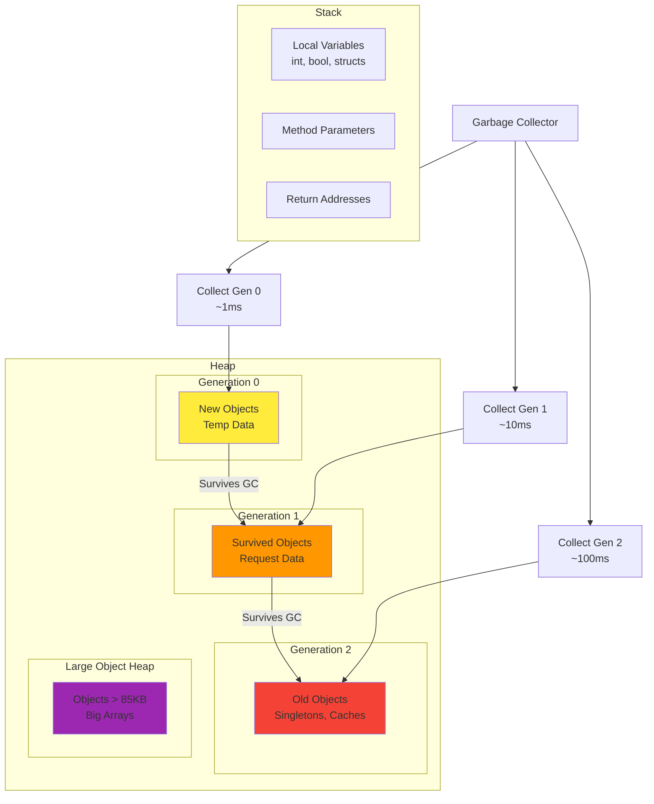

---

## 7️⃣ الـ JWT Authentication Flow

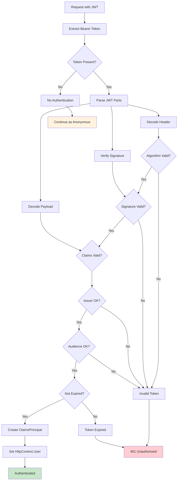

---

## 8️⃣ الـ Connection Pool Management

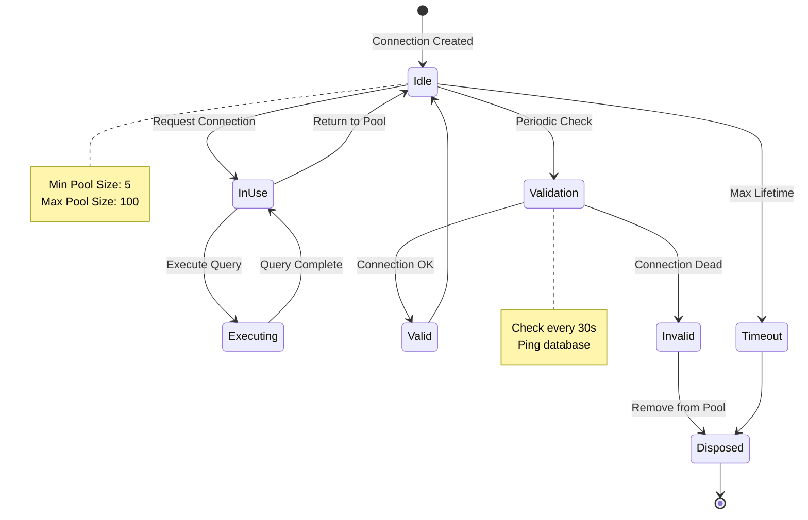

---

## 9️⃣ الـ Model Binding Process

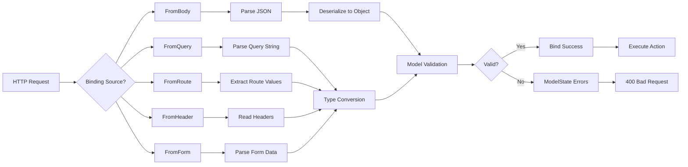

---

## 🔟 الـ Response Generation Pipeline

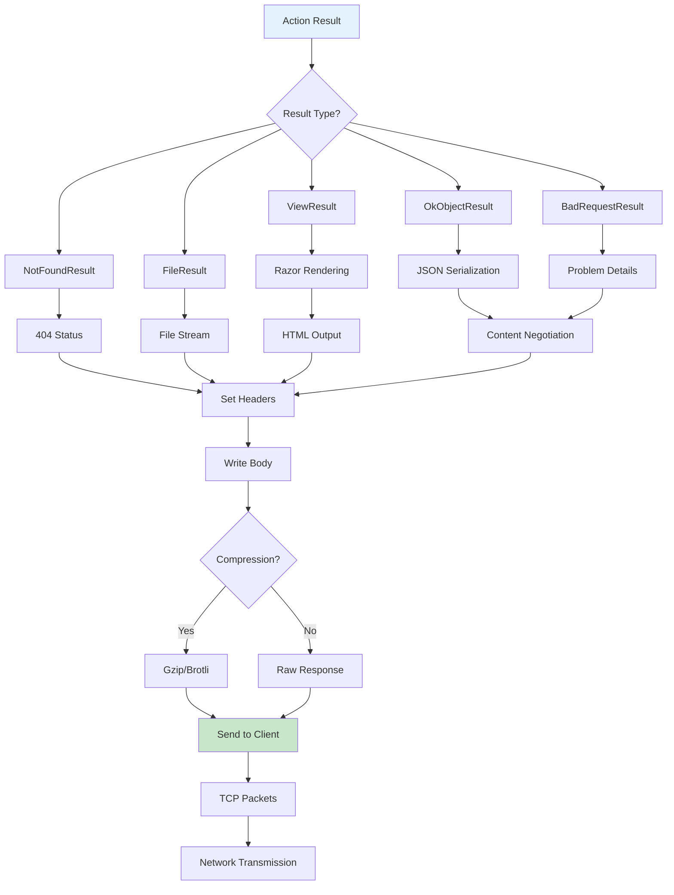

---

## 1️⃣1️⃣ الـ Complete Architecture Overview

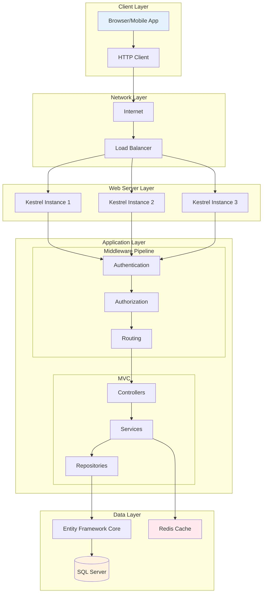

---

## 1️⃣2️⃣ الـ Performance Bottlenecks

```mermaid
graph LR
    subgraph "Common Bottlenecks"
        ThreadPool[Thread Pool<br/>Starvation]
        Memory[Memory<br/>Pressure]
        Database[Database<br/>N+1 Queries]
        Network[Network<br/>Latency]
        CPU[CPU<br/>Intensive]
    end
    
    subgraph "Solutions"
        Async[Use Async/Await]
        Pool[Object Pooling]
        Include[Use Include()]
        Cache[Response Caching]
        Background[Background Jobs]
    end
    
    ThreadPool --> Async
    Memory --> Pool
    Database --> Include
    Network --> Cache
    CPU --> Background
    
    style ThreadPool fill:#ffcdd2
    style Memory fill:#ffcdd2
    style Database fill:#ffcdd2
    style Network fill:#ffcdd2
    style CPU fill:#ffcdd2
    
    style Async fill:#c8e6c9
    style Pool fill:#c8e6c9
    style Include fill:#c8e6c9
    style Cache fill:#c8e6c9
    style Background fill:#c8e6c9
```

---

## 📊 خلاصة الـ Diagrams

الـ Diagrams دي بتوضح:

1. **Request Flow:** من البراوزر للـ Database والرجوع
2. **Middleware Pipeline:** كل خطوة بالتفصيل
3. **Async State Machine:** إزاي الـ Threads بتتحرر
4. **Thread Pool:** إدارة الـ Threads
5. **Database Operations:** من LINQ لـ SQL
6. **Memory Management:** Generations والـ GC
7. **JWT Authentication:** التحقق من الهوية
8. **Connection Pool:** إدارة الاتصالات
9. **Model Binding:** تحويل البيانات
10. **Response Generation:** بناء الرد
11. **Architecture Overview:** الصورة الكاملة
12. **Performance:** المشاكل والحلول

---

**كده كل حاجة بقت واضحة بالرسم! 🎨**
