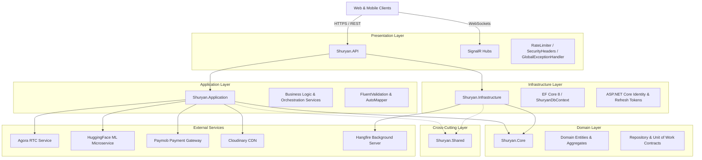

# ShurYan | شُريان — Backend API

[](https://dotnet.microsoft.com/)
[](https://docs.microsoft.com/en-us/dotnet/csharp/)
[](https://learn.microsoft.com/en-us/ef/core/)
[](https://www.microsoft.com/en-us/sql-server/)
[](https://dotnet.microsoft.com/en-us/apps/aspnet/signalr)
[](https://www.agora.io/)
[](https://www.hangfire.io/)
[](#-system-architecture)

> **ShurYan (شُريان)** is an enterprise-grade telehealth, multi-role healthcare management, and emergency response platform. Built on **.NET 8** and **Clean Architecture**, the backend coordinates real-time video consultations, emergency SOS dispatching with medical-legal clinical snapshots, multi-provider credential verification, AI-driven clinical lab interpretations, and automated background job processing.

---

## System Architecture

ShurYan is strictly decoupled using **Clean Architecture** and **Domain-Driven Design (DDD)** principles across 5 modular projects:



### Architectural Principles:
* **Decoupled Domain Core (`Shuryan.Core`):** Zero external framework dependencies. Encapsulates business entities, domain enums, aggregate boundaries, and repository interfaces.
* **Separation of Concerns:** Application layer encapsulates use-cases without knowing database details; Infrastructure layer encapsulates EF Core configurations and external integrations.
* **Resilient Inter-Service Communication:** External services (ML microservice, Agora, Paymob) are abstracted behind domain interfaces and consumed via typed `IHttpClientFactory` clients.

---

## Key Engineering Highlights

### 1. Real-Time Telemedicine & Agora RTC
* **Dual-Party Session State Machine:** State orchestrated across `Waiting` $\rightarrow$ `Active` $\rightarrow$ `Ended` / `Abandoned` with audit timestamps (`DoctorJoinedAt`, `PatientJoinedAt`).
* **Session Authorization Gates:** Validates appointment readiness, ensuring only authorized patient-doctor pairs access the session.
* **Dynamic Media Token Issuance:** Generates time-bound, secure Agora RTC credentials upon state transitions.
* **SignalR Dual-Sync:** Real-time channel `/hubs/video-notify` instantly signals clients when both parties enter the room, synchronizing WebRTC media pipelines.

### 2. Emergency SOS Pipeline & Immutable Clinical Snapshot
* **Low-Latency Geolocation Dispatch:** Patients trigger SOS alerts with live GPS coordinates (`Latitude`, `Longitude`).
* **Active Doctor Oversight Verification:** Matches incoming distress signals to on-duty emergency physicians.
* **Immutable Clinical Snapshotting:** At the exact moment of distress, serializes a frozen JSON snapshot of the patient's vitals, allergies, chronic conditions, and current medications into the database (`EmergencyEvent.MedicalRecordSnapshot`). This prevents retroactive tampering and guarantees legal/medical auditability.
* **Instant SignalR Broadcasting:** Sub-second push alert to assigned physicians with high-priority audio-visual payload and patient coordinates.

### 3. Defense-in-Depth Security & Identity
* **Multi-Role RBAC:** Role-Based Access Control customized across 6 system roles: `Patient`, `Doctor`, `Pharmacy`, `Laboratory`, `Verifier`, and `Admin`.
* **Dual-Token Pipeline:** Short-lived JWT Bearer tokens combined with stateful Refresh Token rotation with cryptographic IP tracking and proactive revocation.
* **Anti-Brute-Force OTP Engine:** High-entropy 6-digit OTP generated via `System.Security.Cryptography.RandomNumberGenerator`. Includes automatic lockout after 5 consecutive failed attempts and rate-limited resend intervals.
* **Partitioned Rate Limiting (.NET 8):** Fine-grained throttling powered by `System.Threading.RateLimiting`:
  * `Global`: 200 requests/minute.
  * `Auth`: 10 requests/minute (prevents credential stuffing).
  * `Payment`: 5 requests/minute per authenticated user.
  * `Webhook`: 30 requests/minute per IP.
* **Defensive HTTP Middleware:** Custom `SecurityHeadersMiddleware` setting strict `X-Frame-Options: DENY`, `X-Content-Type-Options: nosniff`, `Referrer-Policy`, restrictive `Permissions-Policy`, and environment-gated `HSTS`.
* **RFC 7807 Global Exception Handling:** Native .NET 8 `IExceptionHandler` intercepts unhandled exceptions, maps domain exceptions to structured problem responses, and sanitizes production stack traces.

### 4. Resilient AI / ML Microservice Integration
* **Automated Lab Summarization:** Integrates an external Python ML microservice hosted on Hugging Face.
* **Resilience:** Employs a named `IHttpClientFactory` (`LabSummaryClient`) configured with granular timeout rules and failure isolation to parse raw numerical and qualitative lab test results into an accurate, patient-friendly Arabic clinical summary.

### 5. Persistence & Data Integrity
* **Fluent API Relational Modeling:** Strict schema definitions across 40+ tables with explicit foreign key cascading rules and composite indices.
* **Automated Soft Delete & Auditability:** Built-in `SoftDeletableEntity` and `AuditableEntity` pipeline. Queries (`GetAllAsync`, `GetByIdAsync`, `ExistsAsync`) automatically filter out deleted records (`!IsDeleted`) with UTC audit timestamps.
* **Unit of Work & Generic Repositories:** Enforces atomic database transactions with coordinated `SaveChangesAsync()` calls.

### 6. Background Job Orchestration (Hangfire)
* **Persistent Distributed Jobs:** Hangfire integration with SQL Server storage.
* **Automated Payment Expiry:** Scheduled recurring jobs (`IPaymentExpiryJob`) executing every 30 minutes to clean up stale pending transactions and restore appointment slots.
* **Dev Dashboard:** Dedicated `/hangfire` dashboard for real-time monitoring and retry orchestration.

---

## Solution Structure

```text
src/
├── Shuryan.sln                      # .NET 8 Solution Root
│
├── Shuryan.Core/                    # [Domain Layer]
│   ├── Entities/                    # 40+ Domain Entities (User, Appointment, EmergencyEvent, etc.)
│   ├── Enums/                       # System Enums (Roles, Statuses, Specialties, etc.)
│   ├── Common/                      # Base AuditableEntity, SoftDeletableEntity
│   ├── Exceptions/                  # Domain-specific Exceptions
│   └── Interfaces/                  # IGenericRepository<T>, IUnitOfWork
│
├── Shuryan.Application/             # [Business Logic & Orchestration]
│   ├── Services/                    # AuthService, VideoSessionService, EmergencyDispatchService, etc.
│   ├── Interfaces/                  # Application Service Abstractions
│   ├── DTOs/                        # Request / Response Transfer Objects
│   ├── Mappings/                    # AutoMapper Profile Configurations
│   └── Validators/                  # FluentValidation Rules
│
├── Shuryan.Infrastructure/          # [Data Access & External Services]
│   ├── Data/                        # ShuryanDbContext & Fluent API Entity Configurations
│   ├── Repositories/                # Generic & Custom Entity Repositories
│   ├── Migrations/                  # EF Core Code-First Migrations
│   └── Identity/                    # Identity Configuration & Seeders
│
├── Shuryan.Shared/                  # [Cross-Cutting Concerns]
│   ├── Constants/                   # Global Roles, Policies, Claim Types
│   ├── Extensions/                  # Service Collection DI Extensions
│   └── Helpers/                     # Cryptographic RNG & Formatting Helpers
│
└── Shuryan.API/                     # [Presentation Layer]
    ├── Controllers/                 # 33+ RESTful Web API Controllers
    ├── Hubs/                        # NotificationHub, VideoNotificationHub (SignalR)
    ├── Middleware/                  # SecurityHeadersMiddleware, GlobalExceptionHandler
    ├── Extensions/                  # Modular Configuration Extensions (Swagger, RateLimiter)
    └── Program.cs                   # Application Startup, Pipeline & Middleware Configuration
```

---

## Core Functional Modules

| Module | Core Responsibility | Key Endpoints / Hubs |
| :--- | :--- | :--- |
| **Authentication & Identity** | Multi-role registration (4 user types), JWT generation, Refresh Token rotation, Google OAuth, Cryptographic OTP. | `/api/auth/*` |
| **Telemedicine & Video** | Real-time audio/video consultations, Agora RTC token generation, session lifecycle tracking. | `/api/videocall/*`<br>`/hubs/video-notify` |
| **Emergency SOS Dispatch** | GPS distress dispatch, immutable clinical snapshot creation, sub-second doctor notification. | `/api/emergency/*` |
| **Doctors & Clinics** | Clinic scheduling, appointment slots, fee structures, specialties, consultation reviews. | `/api/doctors/*`<br>`/api/clinics/*`<br>`/api/doctorschedule/*` |
| **Patient Care & Records** | Medical history management, appointment booking, lab result tracking, electronic prescriptions. | `/api/patients/*`<br>`/api/patientappointments/*`<br>`/api/patientmedical/*` |
| **Laboratories & ML Analysis** | Lab order lifecycle, test catalogs, Hugging Face ML summary integration. | `/api/laboratories/*`<br>`/api/laborders/*`<br>`/api/patientlab/*` |
| **Pharmacies & Prescriptions** | Medication catalogs, e-prescription fulfillment, public tamper-proof QR code lookup. | `/api/pharmacyprofile/*`<br>`/api/prescriptions/*`<br>`/api/publicrx/*` |
| **Provider Verification** | Administrative verification lifecycle (`Pending` $\rightarrow$ `UnderReview` $\rightarrow$ `Verified` / `Rejected`) for licenses & documents. | `/api/verifier/*` |
| **Payments & Billing** | Paymob integration, HMAC webhook validation, Hangfire payment cleanup jobs. | `/api/payments/*` |
| **Real-Time Notifications** | WebSocket notifications for appointment reminders, order updates, and emergency alerts. | `/hubs/notifications` |

---

## Technology Stack

* **Language & Framework:** C# 12 / .NET 8 (ASP.NET Core Web API)
* **Data Access & ORM:** Entity Framework Core 8 (Code-First, Fluent API, Migrations)
* **Database:** Microsoft SQL Server
* **Security & Auth:** ASP.NET Core Identity, JWT Bearer, Refresh Token Rotation, Cryptographic RNG OTP, .NET 8 Partitioned Rate Limiting
* **Real-Time Communications:** ASP.NET Core SignalR (WebSockets)
* **WebRTC Video Consultations:** Agora RTC Server SDK (Dynamic Token Issuance)
* **Background Jobs:** Hangfire (SQL Server Storage)
* **External Integrations:** Paymob (Payments), Cloudinary (Cloud Storage), Google OAuth 2.0, Hugging Face (ML Microservice)
* **API Documentation:** Swashbuckle / OpenAPI with Universal Dark Theme (`oqo0.SwaggerThemes`)
* **Validation & Mapping:** FluentValidation, AutoMapper

---

## Getting Started & Local Setup

### Prerequisites
* [.NET 8 SDK](https://dotnet.microsoft.com/download/dotnet/8.0)
* [Microsoft SQL Server](https://www.microsoft.com/en-us/sql-server/) (LocalDB, Express, or Developer)
* Visual Studio 2022 / VS Code / JetBrains Rider

### 1. Clone the Repository
```bash
git clone https://github.com/ShurYan-Health-Care/ShurYan-Backend.git
cd ShurYan-Backend/src
```

### 2. Configure `appsettings.json`
Navigate to `Shuryan.API` and configure your credentials or create an `appsettings.Development.Local.json` file:

```json
{
  "ConnectionStrings": {
    "DefaultConnection": "Server=localhost;Database=ShuryanDb;Trusted_Connection=True;MultipleActiveResultSets=true;TrustServerCertificate=True"
  },
  "JwtSettings": {
    "Key": "YOUR_STRONG_SECRET_KEY_AT_LEAST_32_CHARS_LONG",
    "Issuer": "ShuryanAPI",
    "Audience": "ShuryanUsers",
    "DurationInMinutes": 60,
    "RefreshTokenDurationInDays": 7
  },
  "AgoraSettings": {
    "AppId": "YOUR_AGORA_APP_ID",
    "AppCertificate": "YOUR_AGORA_APP_CERTIFICATE"
  },
  "CloudinarySettings": {
    "CloudName": "YOUR_CLOUD_NAME",
    "ApiKey": "YOUR_API_KEY",
    "ApiSecret": "YOUR_API_SECRET"
  },
  "Paymob": {
    "ApiKey": "YOUR_PAYMOB_API_KEY",
    "HmacSecret": "YOUR_HMAC_SECRET"
  }
}
```

### 3. Apply Database Migrations & Seed Data
```bash
dotnet ef database update --project Shuryan.Infrastructure --startup-project Shuryan.API
```
> **Note:** The application automatically seeds baseline roles, administrative accounts, and initial reference data upon startup in the Development environment via `SeedDatabaseAsync()`.

### 4. Run the Application
```bash
dotnet run --project Shuryan.API
```

Once running, access the services:
* **Interactive Swagger UI:** `https://localhost:7198/swagger`
* **Hangfire Dashboard:** `https://localhost:7198/hangfire`

---

## Live Demo & Endpoints

* **Live Web Platform:** [https://shuryan-healthcare.netlify.app/](https://shuryan-healthcare.netlify.app/)
* **Backend Repository:** [https://github.com/ShurYan-Health-Care/ShurYan-Backend](https://github.com/ShurYan-Health-Care/ShurYan-Backend)
Developed as part of the **DEPI (Digital Egypt Pioneers Initiative)** graduation project.

---

## License & Acknowledgments

This project is developed by ShurYan team. All rights reserved.

---

<div align="center">
  <sub>Built with ❤️ for a healthier future.</sub>
</div>
